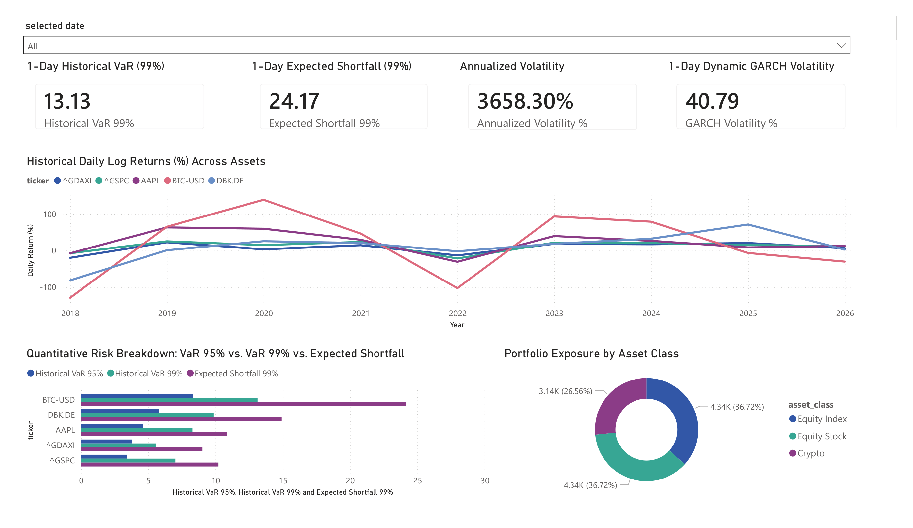
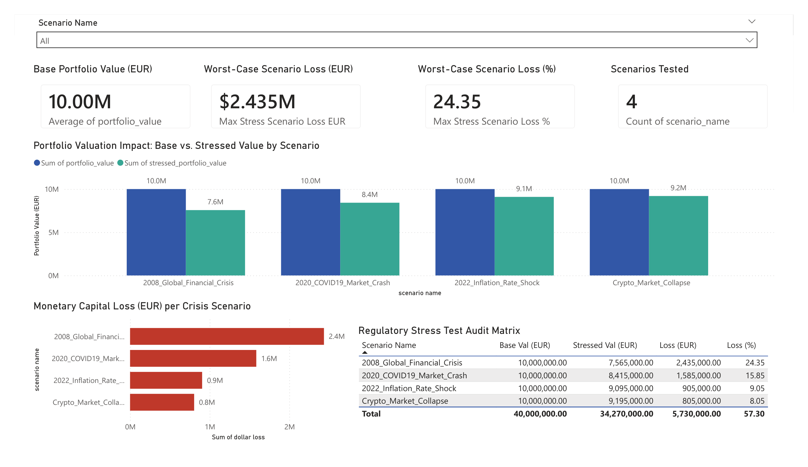
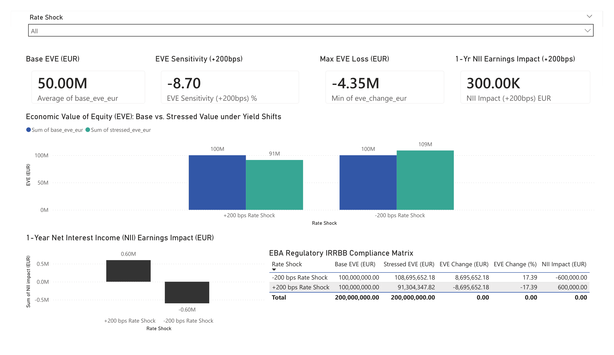
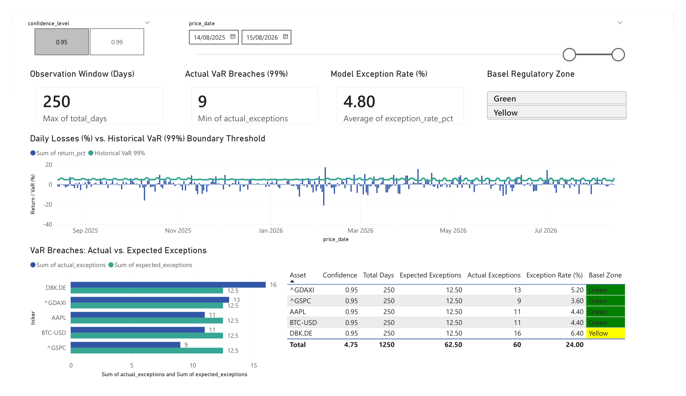

# Market & Credit Risk Analytics Engine

---

## Deutsch: Projektübersicht

### Beschreibung
Eine durchgängige (End-to-End) Pipeline zur Analyse von Markt- und Kreditrisiken für Multi-Asset-Portfolios. Das System lädt automatisiert historische Marktdaten und Zinsstrukturkurven in eine **PostgreSQL**-Datenbank, berechnet Risiko-Kennzahlen (**Value-at-Risk**, **Expected Shortfall**, **GARCH(1,1)**) in **Python** und visualisiert Risikogrenzen sowie Stresstests in einem interaktiven **Power BI Dashboard**.

### Hauptmerkmale
* **Automatisierte ETL-Pipeline**: Ingestion von Aktien-, Index- und Anleihendaten über Python (`yfinance`, `SQLAlchemy`) in ein relationales PostgreSQL-Schema.
* **Quantitative Risikomodellierung**:
  * Parametrisches VaR, Historische Simulation und GARCH(1,1) Volatilitätsmodellierung.
  * Expected Shortfall (Conditional VaR) zur Tail-Risk-Messung.
  * Stresstesting & Szenarioanalyse (+200 BPS Zinskurven-Shifts).
* **Interaktives Risk Reporting**: Power BI Dashboard zur Überwachung von P&L-Entwicklungen, VaR-Schwellenwertverletzungen und Zinsrisiken (EVE/NII).

### Technologie-Stack
* **Datenbank**: PostgreSQL 16 (Star Schema, B-Tree Indizes, Foreign Key Cascades)
* **Programmiersprache**: Python 3.11 (`Pandas`, `NumPy`, `Statsmodels`, `SQLAlchemy`, `Arch`)
* **Visualisierung**: Power BI Desktop (DAX, Dynamic Risk Limits)

---

## 📊 Power BI Dashboard Previews

### Page 1: Executive Portfolio & Market Risk Overview

### Page 2: Stress Testing & Scenario Analysis (Basel III)

### Page 3: Asset Liability Management (ALM) & Interest Rate Risk

### Page 4: Model Backtesting & Basel III Traffic Light System

---

## English: Project Overview

### Description
An end-to-end Market and Credit Risk Analytics Engine designed for multi-asset portfolios. The pipeline automatically ingests daily market prices and treasury yield curves into a **PostgreSQL** database, computes quantitative risk metrics (**Value-at-Risk**, **Expected Shortfall**, **GARCH(1,1)**) using **Python**, and reports risk limit breaches and stress testing scenarios via an interactive **Power BI Dashboard**.

### Key Features
* **Automated ETL Pipeline**: Daily market data and yield curve ingestion via Python (`yfinance`, `SQLAlchemy`) into a PostgreSQL relational schema.
* **Quantitative Risk Analytics**:
  * Parametric VaR, Historical Simulation, and GARCH(1,1) volatility forecasting.
  * Expected Shortfall (Conditional VaR) for tail-risk evaluation.
  * Stress testing engine simulating macroeconomic and interest rate shocks (+200 bps yield curve shift).
* **Interactive Risk Reporting**: Power BI dashboard displaying daily P&L, VaR limit breaches, volatility heatmaps, and interest rate sensitivity (EVE/NII).

### Tech Stack
* **Database**: PostgreSQL 16 (Star Schema, B-Tree Indexing, Referential Integrity)
* **Programming**: Python 3.11 (`Pandas`, `NumPy`, `Statsmodels`, `SQLAlchemy`, `Arch`)
* **BI & Analytics**: Power BI Desktop (DAX, Risk Metrics Visualization)

